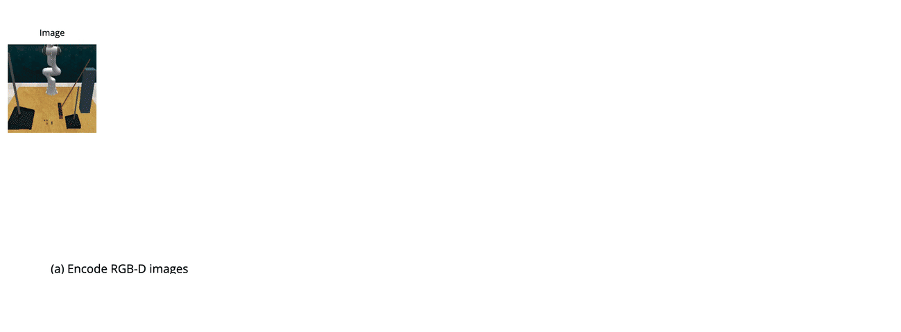
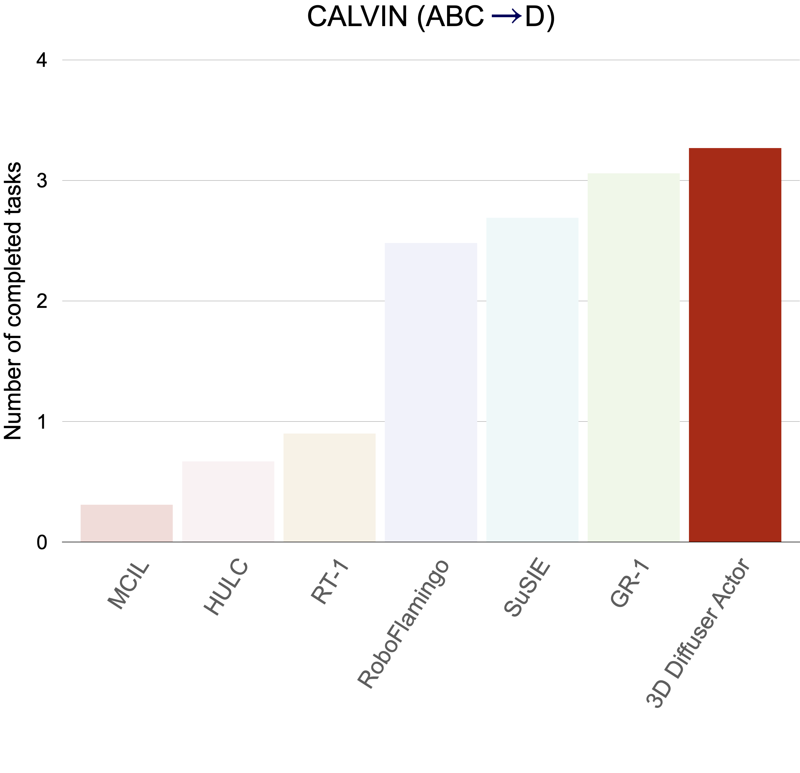
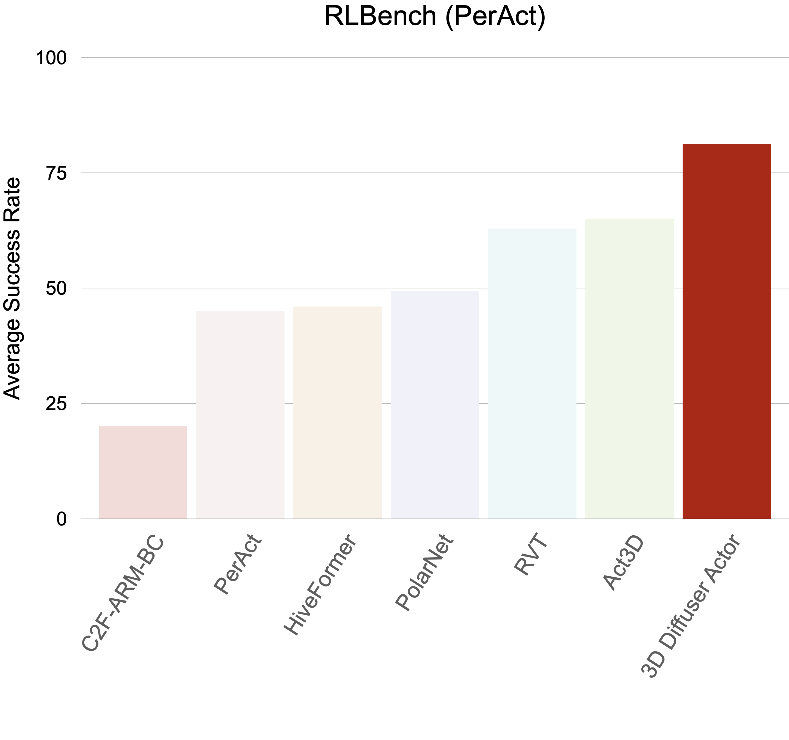

[](https://paperswithcode.com/sota/zero-shot-generalization-on-calvin?p=3d-diffuser-actor-policy-diffusion-with-3d)
[](https://paperswithcode.com/sota/robot-manipulation-on-rlbench?p=3d-diffuser-actor-policy-diffusion-with-3d)


# 3D Diffuser Actor: Policy Diffusion with 3D Scene Representations
By [Tsung-Wei Ke*](https://twke18.github.io/), [Nikolaos Gkanatsios*](https://nickgkan.github.io/) and [Katerina Fragkiadaki](https://www.cs.cmu.edu/~katef/)

Official implementation of ["3D Diffuser Actor: Policy Diffusion with 3D Scene Representations"](https://arxiv.org/abs/2402.10885).

This code base also includes our re-implementation of ["Act3D: 3D Feature Field Transformers for Multi-Task Robotic Manipulation"](https://arxiv.org/abs/2306.17817).  We provide trained model weights for both methods.

<!--  -->


We marry diffusion policies and 3D scene representations for robot manipulation. Diffusion policies learn the action distribution conditioned on the robot and environment state using conditional diffusion models. They have recently shown to outperform both deterministic and alternative state-conditioned action distribution learning methods. 3D robot policies use 3D scene feature representations aggregated from a single or multiple camera views using sensed depth. They have shown to generalize better than their 2D counterparts across camera viewpoints. We unify these two lines of work and present 3D Diffuser Actor, a neural policy architecture that, given a language instruction, builds a 3D representation of the visual scene and conditions on it to iteratively denoise 3D rotations and translations for the robot’s end-effector. At each denoising iteration, our model represents end-effector pose estimates as 3D scene tokens and predicts the 3D translation and rotation error for each of them, by featurizing them using 3D relative attention to other 3D visual and language tokens. 3D Diffuser Actor sets a new state-of-the-art on RLBench with an absolute performance gain of 16.3% over the current SOTA on a multi-view setup and an absolute gain of 13.1% on a single-view setup. On the CALVIN benchmark, it outperforms the current SOTA in the setting of zero-shot unseen scene generalization by being able to successfully run 0.2 more tasks, a 7% relative increase. It also works in the real world from a handful of demonstrations. We ablate our model’s architectural design choices, such as 3D scene featurization and 3D relative attentions, and show they all help generalization. Our results suggest that 3D scene representations and powerful generative modeling are keys to efficient robot learning from demonstrations.


# Model overview and stand-alone usage
To facilitate fast development on top of our model, we provide here an [overview of our implementation of 3D Diffuser Actor](./docs/OVERVIEW.md).

The model can be indenpendently installed and used as stand-alone package.
```
> pip install -e .
# import the model
> from diffuser_actor import DiffuserActor, Act3D
> model = DiffuserActor(...)
```

# Installation
Create a conda environment with the following command:

```
# initiate conda env
> conda update conda
> conda env create -f environment.yaml
> conda activate 3d_diffuser_actor

# install diffuser
> pip install diffusers["torch"]

# install dgl (https://www.dgl.ai/pages/start.html)
>  pip install dgl==1.1.3+cu116 -f https://data.dgl.ai/wheels/cu116/dgl-1.1.3%2Bcu116-cp38-cp38-manylinux1_x86_64.whl

# install flash attention (https://github.com/Dao-AILab/flash-attention#installation-and-features)
> pip install packaging
> pip install ninja
> pip install flash-attn==2.5.9.post1 --no-build-isolation
```

### Install CALVIN locally

Remember to use the latest `calvin_env` module, which fixes bugs of `turn_off_led`.  See this [post](https://github.com/mees/calvin/issues/32#issuecomment-1363352121) for detail.
```
> git clone --recurse-submodules https://github.com/mees/calvin.git
> export CALVIN_ROOT=$(pwd)/calvin
> cd calvin
> cd calvin_env; git checkout main
> cd ..
> ./install.sh; cd ..
```

### Install RLBench locally
```
# Install open3D
> pip install open3d

# Install PyRep (https://github.com/stepjam/PyRep?tab=readme-ov-file#install)
> git clone https://github.com/stepjam/PyRep.git 
> cd PyRep/
> wget https://www.coppeliarobotics.com/files/V4_1_0/CoppeliaSim_Edu_V4_1_0_Ubuntu20_04.tar.xz
> tar -xf CoppeliaSim_Edu_V4_1_0_Ubuntu20_04.tar.xz;
> echo "export COPPELIASIM_ROOT=$(pwd)/CoppeliaSim_Edu_V4_1_0_Ubuntu20_04" >> $HOME/.bashrc; 
> echo "export LD_LIBRARY_PATH=\$LD_LIBRARY_PATH:\$COPPELIASIM_ROOT" >> $HOME/.bashrc;
> echo "export QT_QPA_PLATFORM_PLUGIN_PATH=\$COPPELIASIM_ROOT" >> $HOME/.bashrc;
> source $HOME/.bashrc;
> conda activate 3d_diffuser_actor
> pip install -r requirements.txt; pip install -e .; cd ..

# Install RLBench (Note: there are different forks of RLBench)
# PerAct setup
> git clone https://github.com/MohitShridhar/RLBench.git
> cd RLBench; git checkout -b peract --track origin/peract; pip install -r requirements.txt; pip install -e .; cd ..;
```

Remember to modify the success condition of `close_jar` task in RLBench, as the original condition is incorrect.  See this [pull request](https://github.com/MohitShridhar/RLBench/pull/1) for more detail.  

# Data Preparation

See [Preparing RLBench dataset](./docs/DATA_PREPARATION_RLBENCH.md) and [Preparing CALVIN dataset](./docs/DATA_PREPARATION_CALVIN.md).


### (Optional) Encode language instructions

We provide our scripts for encoding language instructions with CLIP Text Encoder on CALVIN.  Otherwise, you can find the encoded instructions on CALVIN and RLBench ([Link](https://huggingface.co/katefgroup/3d_diffuser_actor/blob/main/instructions.zip)).
```
> python data_preprocessing/preprocess_calvin_instructions.py --output instructions/calvin_task_ABC_D/validation.pkl --model_max_length 16 --annotation_path ./calvin/dataset/task_ABC_D/validation/lang_annotations/auto_lang_ann.npy

> python data_preprocessing/preprocess_calvin_instructions.py --output instructions/calvin_task_ABC_D/training.pkl --model_max_length 16 --annotation_path ./calvin/dataset/task_ABC_D/training/lang_annotations/auto_lang_ann.npy
```

**Note:** We update our scripts for encoding language instructions on RLBench.
```
> python data_preprocessing/preprocess_rlbench_instructions.py  --tasks place_cups close_jar insert_onto_square_peg light_bulb_in meat_off_grill open_drawer place_shape_in_shape_sorter place_wine_at_rack_location push_buttons put_groceries_in_cupboard put_item_in_drawer put_money_in_safe reach_and_drag slide_block_to_color_target stack_blocks stack_cups sweep_to_dustpan_of_size turn_tap --output instructions.pkl
```

# Model Zoo

We host the model weights on hugging face.

|| RLBench (PerAct) | RLBench (GNFactor) | CALVIN (old, w\ history) | CALVIN (new, w\o history) |
|--------|--------|--------|--------|--------|
| 3D Diffuser Actor | [Weights](https://huggingface.co/katefgroup/3d_diffuser_actor/blob/main/diffuser_actor_peract.pth) | [Weights](https://huggingface.co/katefgroup/3d_diffuser_actor/blob/main/diffuser_actor_gnfactor.pth) | [Weights](https://huggingface.co/katefgroup/3d_diffuser_actor/blob/main/diffuser_actor_calvin.pth) | [Weights](https://huggingface.co/katefgroup/3d_diffuser_actor/blob/main/diffuser_actor_calvin_nohistory.pth) |
| Act3D | [Weights](https://huggingface.co/katefgroup/3d_diffuser_actor/blob/main/act3d_peract.pth) | [Weights](https://huggingface.co/katefgroup/3d_diffuser_actor/blob/main/act3d_gnfactor.pth) | N/A | N/A |

<div class="column">

&nbsp;&nbsp;&nbsp;

</div>

### Evaluate the pre-trained weights
First, donwload the weights and put under `train_logs/`

* For RLBench, run the bashscripts to test the policy.  See [Getting started with RLBench](./docs/GETTING_STARTED_RLBENCH.md#step-3-test-the-policy) for detail.
* For CALVIN, you can run [this bashcript](./scripts/test_trajectory_calvin.sh).

**Important note:** Our released model weights of 3D Diffuser Actor assume input quaternions are in `wxyz` format.  Yet, we didn't notice that CALVIN and RLBench simulation use different quaternion formats (`wxyz` and `xyzw`).  We have updated our code base with an additional argument `quaternion_format` to switch between these two formats.  We have verified the change by re-training and testing 3D Diffuser Actor on GNFactor with `xyzw` quaternions.  The model achieves similar performance as the released checkpoint.  Please see this [post](https://github.com/nickgkan/3d_diffuser_actor/issues/3#issue-2164855979) for more detail.

For users to train 3D Diffuser Actor from scratch, we update the training scripts with the correct `xyzw` quaternion format.  For users to test our released model, we keep the `wxyz` quaternion format in the testing scripts ([Peract](./online_evaluation_rlbench/eval_peract.sh), [GNFactor](./online_evaluation_rlbench/eval_gnfactor.sh)).

**Update (08/16/2024):** We released a new model weights of 3D Diffuser Actor for manipulation on CALVIN, which does not condition on history end-effector poses, but achieves better performance!  Try [this script](./scripts/train_trajectory_calvin_nohistory.sh) to test our new model.


# Getting started

See [Getting started with RLBench](./docs/GETTING_STARTED_RLBENCH.md) and [Getting started with CALVIN](./docs/GETTING_STARTED_CALVIN.md).


# Citation
If you find this code useful for your research, please consider citing our paper ["3D Diffuser Actor: Policy Diffusion with 3D Scene Representations"](https://arxiv.org/abs/2402.10885).
```
@article{3d_diffuser_actor,
  author = {Ke, Tsung-Wei and Gkanatsios, Nikolaos and Fragkiadaki, Katerina},
  title = {3D Diffuser Actor: Policy Diffusion with 3D Scene Representations},
  journal = {Arxiv},
  year = {2024}
}
```

# License
This code base is released under the MIT License (refer to the LICENSE file for details).

# Acknowledgement
Parts of this codebase have been adapted from [Act3D](https://github.com/zhouxian/act3d-chained-diffuser) and [CALVIN](https://github.com/mees/calvin).
